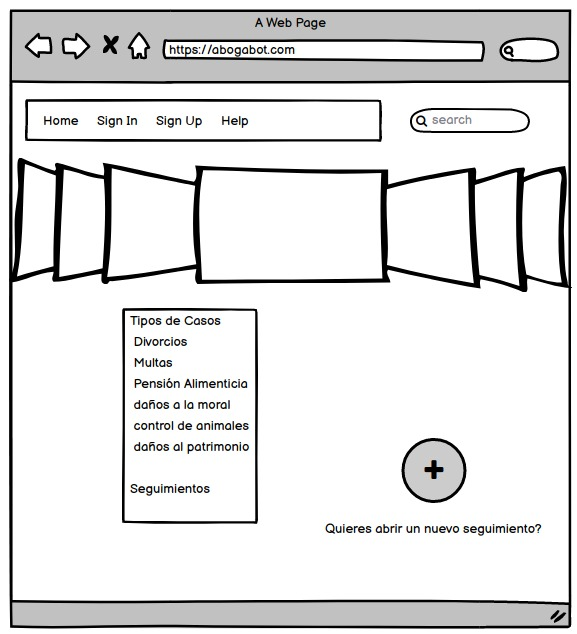

#Wireframes con el ciclo de vida del sistema

El cliente de la firma de abogados al ingresar a nuestro sitio le mostrará la siguiente pantalla, donde podrá ver una sección de noticias a modo de carrusel del cuál podrá solo podrá leer breves descripciones por temas de confidencialidad.
Posterior a eso tendrá una lista de casos (no todos los que maneja la firma) donde podrá basarse para decidir que tipo de caso esta por ingresar al sistema, también cuenta con el botón de agregar un seguimiento que lo llevara a la siguiente pantalla.

En esta pantalla podremos ver un login donde si el usuario ya tiene credenciales, en este caso ya se haya registrado podrá entrar al sistema donde podrá visualizar su seguimiento o seguimientos si es el caso. Y en caso de que sea un socio de la firma podrá ver los seguimientos que esta atendiendo.

En dado caso de que el usuario sea un nuevo cliente de la firma tendrá que hacer un registro para darse de alta en la base de datos, donde pondrá las primeras características de la demanda y posteriormente hacer el pago del mismo.

En este punto ya estamos dado de alta nosotros como usuarios y también estan dados de alta los seguimientos, donde la pantalla por ser sencilla solo pondremos los casos, un botón para agregar mas casos y una caja para hacer acotaciones, aclaraciones, dudas, etc. por parte del usuario cliente o el usuario abogado.

Ahora bien, terminando tendremos el dashboard del usuario administrador el cuál podrá visualizar una grafica de comparación del progreso de los casos.
También podrá visualizar el estado de las demandas así como ciertos detalles al seleccionar el caso para mayor información. Como restricción tenemos que el administrador solo podrá visualizar algunos aspectos de las demandas, como es el caso, el seguimiento, el juicio, el estado, el demandante y el abogado a cargo de dicho caso.

